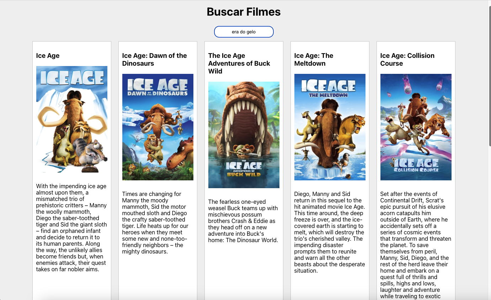
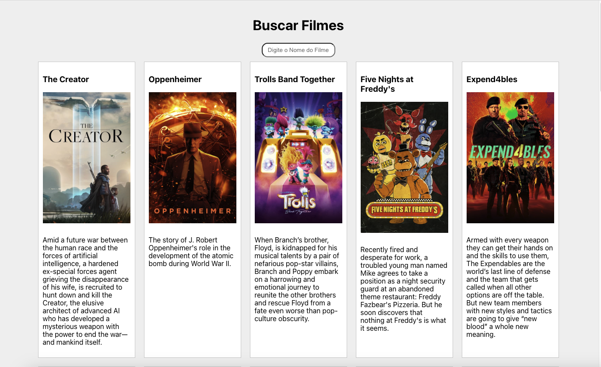

# Movies API 
[](https://github.com/devsuperior/sds1-wmazoni/blob/master/LICENSE) 

# Sobre o projeto


Movie API é uma aplicação full stack web construida para praticar, Consumindo a API do TMBD.

A aplicação consiste em uma pesquisa de preferência de filmes, onde os dados sao coletados da api do tmdb e listados, onde na tela inicial mostra os filmes mais populares e ao digitar já realiza buscar na api pelo nome informado.


## Layout web





# Tecnologias utilizadas
## Back end
- Java
- Spring Boot
- Maven
## Front end
- HTML / CSS / JS / 
- ReactJS
- AXIOS

# Como executar o projeto

## Back end
Pré-requisitos: Java 17

```bash
# clonar repositório
git clone https://github.com/JailsonFSantos/Movies-API

# entrar na pasta do projeto back end
cd movie

# executar o projeto
./mvnw spring-boot:run
```

## Front end web
Pré-requisitos: npm / yarn

```bash
# clonar repositório
git clone https://github.com/JailsonFSantos/Movies-API

# entrar na pasta do projeto front end web
cd movie-search-app

# instalar dependências
npm install

# executar o projeto
npm start
```

# Autor

Jailson Francisco dos Santos

https://www.linkedin.com/in/jailson-santos-149202234/
